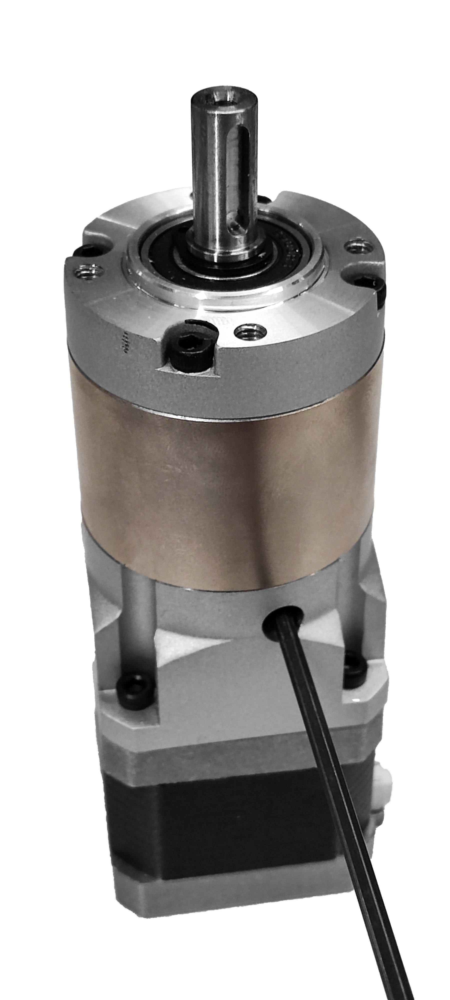
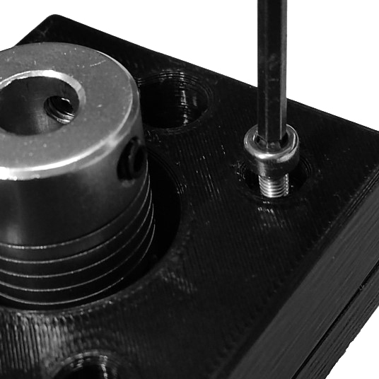
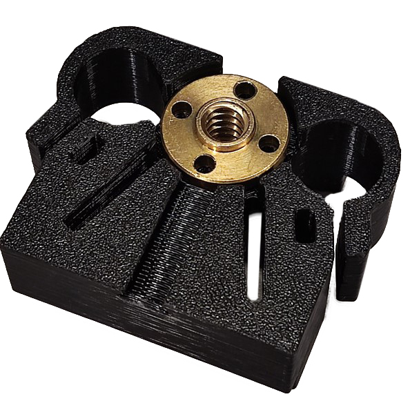
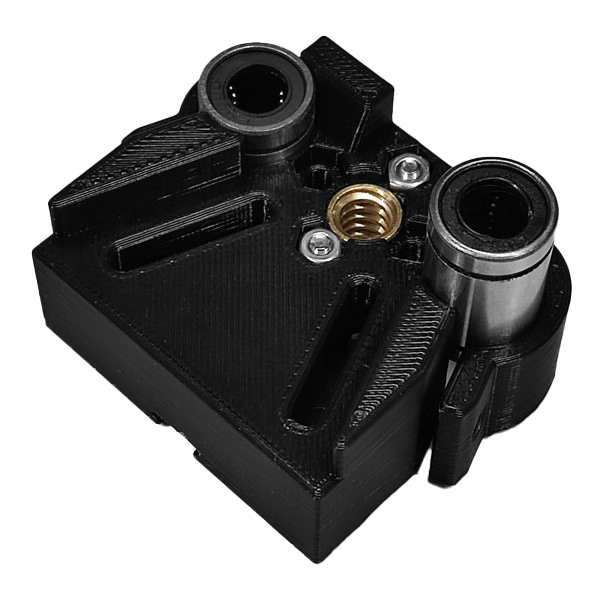
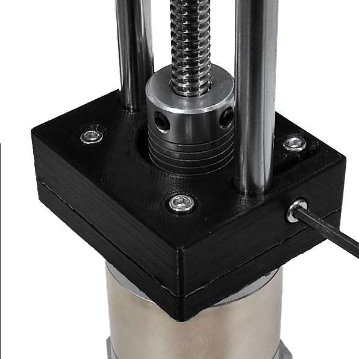

# Ensamblaje de la bomba

*Este diseño está basado en [Open-Source Syringe Pump](https://www.mass-spec.ru/projects/diy/syringe_pump/eng/) desarrollado por Andrey Samokhin*

{{BOM}}

>i Debes construir al menos 02 bombas de jeringa para experimentos de microfluídica de gotas.

## Ensambla el motor paso a paso y la caja de cambios {pagestep}

Inserta el eje del [motor NEMA 17](parts/electronica/NEMA-17-motor.md){qty: 1, cat: electronica} en la [caja de cambios][caja de cambios 100:1](parts/mecanica/caja-cambios-100-1.md){qty: 1, cat: mecanica} y fíjala a la carcasa usando cuatro [tornillos M3 8mm][tornillo M3 8mm](parts/mecanica/tornillo-M3-8mm.md){qty: 4, cat:mecanica}. Usa una [llave Allen M3](parts/herramientas/llave-allen-M3.md){qty: 1, cat: herramientas} para apretarlos.

Luego, utiliza la misma llave Allen para apretar los dos tornillos de sujeción dentro de la caja de cambios y conectar el eje del motor a los engranajes. Asegúrate de que uno de los tornillos de sujeción esté alineado con la parte plana del eje del motor, si es que tiene una.

## Ensambla la caja de cambios, el soporte posterior y la varilla roscada {pagestep}

Toma el [soporte posterior - A][Back support - A](fromstep){qty:1, cat: piezaimpresa}, cuatro [insertos roscados M3][inserto roscado M3](parts/mecanica/inserto-roscado-M3.md){qty:4,cat: mecanica} y colócalas en cada agujero de esta pieza impresa como se muestra a continuación. Aplica calor a cada inserto (usando un [soldador][soldador](parts/herramientas/soldador.md){qty:1,cat:herramientas}) y usa una fuerza suave para empujarlos hasta su lugar, como se describe en la [guía para usar insertos roscados](https://hackaday.com/2019/02/28/threading-3d-printed-parts-how-to-use-heat-set-inserts/)

Toma cuatro [tornillos M4 10mm][tornillo M4 10mm](parts/mecanica/tornillo-M4-10mm.md){qty: 4, cat:mecanica} y una [llave Allen M4](parts/herramientas/llave-allen-M4.md){qty: 1, cat: herramientas} para fijar el [soporte posterior - A][Back support - A] a la caja de cambios. Asegúrate de que la orientación de la pieza sea correcta. El tornillo indicado debe estar opuesto al conector eléctrico del motor paso a paso.

Inserta el eje de la [caja de cambios][caja de cambios 100:1] a la mitad dentro del [acople flexible de motor][acople flexible de aluminio](parts/mecanica/acople-flexible-motor.md){qty: 1, cat: mecanica} y luego apriétalo. Usa una  una [llave Allen M2](parts/herramientas/llave-allen-M2.md){qty: 1, cat: herramientas} para ajustar el acople.

Toma cuatro [tornillos M3 16mm][tornillo M3 16mm](parts/mecanica/tornillo-M3-16mm.md){qty: 4, cat:mecanica} para fijar el [soporte posterior - B][Back support - B](fromstep){qty:1, cat: piezaimpresa} a la pieza A. Asegúrate de que los agujeros del soporte B estén alineados con las insertos roscados.

Toma la [varilla roscada][varilla roscada](parts/mecanica/varilla-roscada.md){qty: 1, cat:mecanica} e insértalo en el acople flexible de motor. Luego, aprieta el acople sobre la varilla.

Toma dos [tuercas M3][tuerca M3](parts/mecanica/tuerca-M3.md){qty: 2, cat:mecanica}, insértalas en el [soporte posterior - B][Back support - B] y presiónalas hasta el fondo. Usa cualquier herramienta que necesites para empujarlas. Asegúrate de que estén alineadas con los agujeros del soporte. Luego, toma dos [tornillos M3 10mm][tornillo M3 10mm](parts/mecanica/tornillo-M3-10mm.md){qty: 2,cat:mecanica} y enróscalos para sostener las tuercas. Usa una [llave Allen M3].

## Ensambla e implementa el carruaje {pagestep}

Inserta la [tuerca de la varilla roscada][tuerca de varilla roscada](parts/mecanica/tuerca-varilla-roscada.md){qty: 1, cat:mecanica} en el [carruaje][Carriage](fromstep){qty:1, cat: piezaimpresa} y fíjala al carruaje con dos [tornillos M3 16mm][tornillo M3 16mm]{qty: 2} y dos [tuercas M3][tuerca M3]{qty: 2}. Inserta los tornillos desde el lado opuesto para sujetar bien la tuerca de la varilla.

Toma el [carruaje][Carriage], luego toma los [rodamientos lineales][rodamiento lineal](parts/mecanica/rodamiento-lineal.md){qty:2, cat:mecanica} e insértalos en los laterales del carruaje. Después, toma dos [tuercas M3][tuerca M3]{qty: 2} e insértalas en el carruaje y presiónalas. Usa cualquier herramienta que necesites para empujarlas. Asegúrate de que estén alineadas con los agujeros. Toma dos [tornillos M3 12mm][tornillo M3 12mm](parts/mecanica/tornillo-M3-12mm.md){qty: 2,cat:mecanica} y una llave Allen M3 para fijar los rodamientos.

Inserta la varilla en la tuerca. Luego, enróscalo manualmente hasta la mitad de la varilla como se muestra a continuación.

Empuja los [rieles lineales][varilla lisa](parts/mecanica/varilla-lisa.md){qty: 2, cat: mecanica} a través de los rodamientos del [carruaje] e insértalos en el [soporte posterior - B][Back support - B], uno por el lado izquierdo y otro por el derecho. Asegúrate de que entren correctamente en los agujeros y luego empújalos hasta el fondo. Fíjalos al soporte posterior B.

## Ensambla el soporte frontal, las perillas y los ajustes de jeringas {pagestep}

Toma el [soporte frontal][Front support](fromstep){qty:1, cat: piezaimpresa}, dos [insertos roscados M3][inserto roscado M3]{qty:2,cat: mecanica} y colócalas en cada agujero de esta pieza impresa. Aplica calor a cada inserto (usando un [soldador][soldador]) y usa una fuerza suave para empujarlos hasta su lugar, como se describe en la [guía para usar insertos roscados](https://hackaday.com/2019/02/28/threading-3d-printed-parts-how-to-use-heat-set-inserts/)

Inserta[tuercas M3][tuerca M3]{qty: 2} en las cavidades del soporte frontal. Usa cualquier herramienta para empujarlas. Asegúrate de que estén alineadas con los agujeros del soporte. Toma dos [tornillos M3 16mm][tornillo M3 16mm]{qty: 2} y enróscalos lo suficiente para sostener las tuercas.

Inserta una [tuerca M3]{qty: 1} en la cavidad de la [perilla][Hand knob](fromstep){qty:2, cat: piezaimpresa}. Toma [tornillo M3 20mm][tornillo M3 20mm](parts/mecanica/tornillo-M3-20mm.md){qty: 2, cat:mecanica} y enróscalo por completo. Repite este paso con la segunda perilla.

## Ensambla el soporte frontal y los rieles lineales {pagestep}

Alinea los rieles lineales con el soporte frontal para asegurarte de que entren correctamente en los agujeros y luego presiónalos. Fija los rieles lineales al soporte frontal.

Finalmente, toma el [ajuste de jeringa][Syringe holder](fromstep){qty:1, cat: piezaimpresa} y colócalo en el soporte frontal. Asegúrate de que los agujeros de ambas piezas estén alineados. Toma las dos perillas y enróscalas un poco.

La bomba de jeringa esta lista para ser usada.

