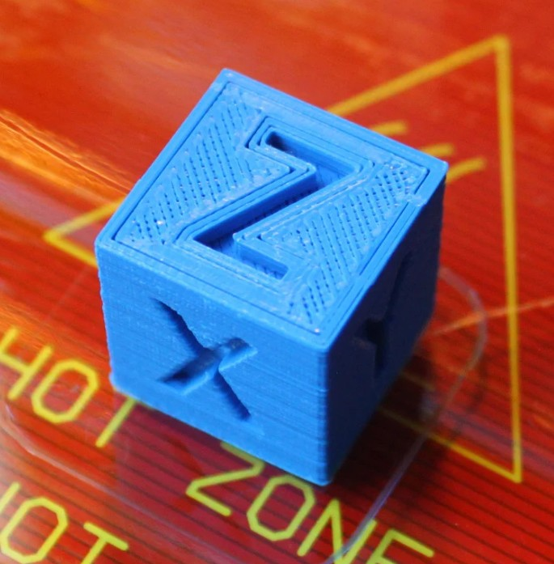

# Fabricación de piezas plásticas

{{BOM}}

## Configura tu impresora 3D{pagestep}

Todas las piezas plásticas de la bomba de jeringa pueden ser impresas con [impresoras 3D][impresora 3D](parts/herramientas/impresora-3D.md){qty: 1,cat: herramientas}, estilo Rep-Rap, y con [filamento PLA](parts/insumo/filamento-pla.md){qty: 200 g,cat: insumo}.

Para la fabricación de piezas, te recomendamos configurar tu impresora con los siguientes parámetros:

|Parámetro        |Valor          |
|------------   |--             |
|Material       |PLA            |
|Material Temperature |Recommended by the PLA brand|
|Layer height   |0.2mm or less  |
|Infill         |Printer default or more|
|Brim           |Recommended for all parts|
|Slice gap closing radius |0.001mm |

Para comprobar la calibración de tu impresora, descarga este cubo e imprímelo:

Una vez impreso, compara las dimensiones del cubo y las letras respecto a las dimensiones en el software de diseño:

## Impresión 3D de piezas{pagestep}

Ahora que verificaste el funcionamiento de tu impresora 3D con el filamento PLA, puedes imprimir las piezas de la bomba de jeringa:

* [Back support - A]{output, qty: 1}: [back-support-A.stl](models/back-support-A.stl){previewpage}
* [Back support - B]{output, qty: 1}: [back-support-B.stl](models/back-support-B.stl){previewpage}
* [Carriage]{output,qty:1}: [carriage.stl](models/carriage.stl){previewpage}
* [Front support]{output,qty:1}: [front-support.stl](models/front-support.stl){previewpage}
* [Syringe holder]{output,qty:1}: [syringe-holders.stl](models/syringe-holders.stl){previewpage}
* [Hand knob]{output,qty:2}: [hand-knob.stl](models/hand-knob.stl){previewpage}

## Limpieza de piezas {pagestep}

>!! **Warning** 
>!!
>!! **Ten cuidado al remover los excesos:** Para evitar accidentes, primero remueve los excesos sin objetos punzocortantes. Luego, retira el remanente utilizando la técnica descrita abajo.

Cuidadosamente remueve los excesos de impresión de todas las piezas plásticas:

1. Utiliza un [alicate de corte diagonal](parts/herramientas/alicate-corte-diagonal.md){qty: 1,cat: herramientas} para remover la mayoría de excesos de impresión de cada parte.

2. Limpia los remanentes de impresión con un [cuchillo de hoja rectráctil](parts/herramientas/cuchillo-hoja-retractil.md){qty: 1,cat: herramientas}:

* Sosten el cuchillo en tu mano dominante con tus cuatro dedos alrededor del mango, dejando libre tu pulgar.
* Sosten la pieza plástica en tu otra mano, en la zona más alejada posible de las superficies a ser cortadas.
* Apoya la pieza plástica en el pulgar de tu mano dominante.
* Coloca la hoja del cuchillo en la superficie que será cortada, y cuidadosamente cierra tu mano dominante, moviendo la hoja, con control, hacia tu pulgar.

