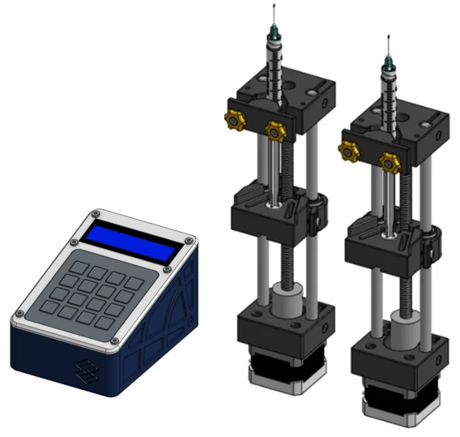

# Bombas de Jeringa Open-Source

La bomba de jeringa es un instrumento científico abierto diseñado para aplicaciones en microfluídica y otros flujos de trabajo de laboratorio que requieren un control estable del caudal de fluidos. Existen múltiples diseños abiertos disponibles, y este modelo combina algunas de las mejores características de ellos, tomando como base un diseño versátil y validado. Esta herramienta permite un control preciso del caudal, especialmente en rangos bajos, lo que la hace ideal para entornos de investigación.

Para la fabricación del instrumento, primero debes conseguir los componentes de la [lista de materiales]{BOM}  y luego seguir las instrucciones de:

* [Fabricación de piezas plásticas](fabricacion-piezas.md){step}
* [Ensamblaje de bomba de jeringa](ensamblaje-bomba.md){step}